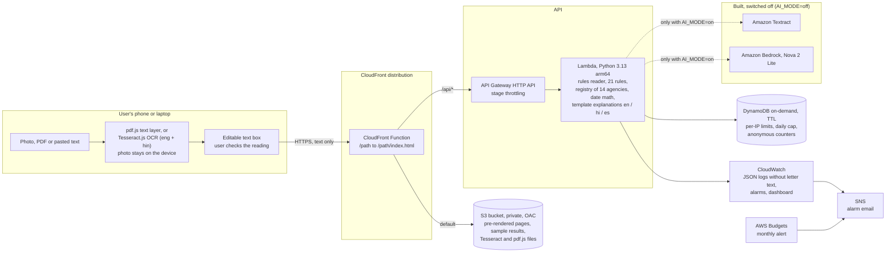

# Architecture

Plainly runs in one AWS account in us-east-1. Everything except the account-level CloudTrail trail is in one plain CloudFormation template, `infra/template.yaml`. The agent's IAM policy and the permissions boundary for roles it creates are in `infra/agent-iam-policy.json` and `infra/plainly-boundary-policy.json`.

The live product runs with `AI_MODE=off` (the template parameter `AiMode`, default `off`). The account is on the AWS Free account plan, which doesn't include Amazon Bedrock or Amazon Textract, so the letter is read on the user's device and the Lambda runs deterministic code only. The Textract + Nova path is still in the code and is described at the end of this page.

## Diagram



The page and `/api/*` share one CloudFront distribution, so the browser talks to a single origin.

## ASCII fallback

```
+------------------------------- user's device --------------------------------+
|  photo / PDF / pasted text                                                   |
|    -> pdf.js text layer (PDF with real text)                                 |
|    -> or Tesseract.js OCR, eng + hin (photos, scanned PDFs)                  |
|    -> editable text box: the user fixes misreadings                          |
|  The photo never leaves the device. Only the text is sent.                   |
+------------------------------------+-----------------------------------------+
                                     | HTTPS
                                     v
                    +-------------------------------------------+
                    | CloudFront (one URL)                      |
                    |  CloudFront Function: /x -> /x/index.html |
                    +---------+-----------------------+---------+
                              | default               | /api/*
                              v                       v
              +---------------------------+   +--------------------------+
              | S3 bucket, private, OAC   |   | API Gateway HTTP API     |
              | pre-rendered HTML,        |   | stage throttling         |
              | sample results,           |   +------------+-------------+
              | /vendor/tesseract, pdfjs  |                |
              +---------------------------+                v
                                   +-------------------------------------------+
                                   | Lambda (Python 3.13, arm64), AI_MODE=off  |
                                   |  POST /api/check                          |
                                   |    reader.py   keyword + date reader      |
                                   |    verifier.py 21 rules, score, verdict   |
                                   |    registry    14 agencies, sourced       |
                                   |    dates.py    deadline arithmetic        |
                                   |  POST /api/explain                        |
                                   |    explain_templates.py  en / hi / es     |
                                   +------+----------------------+-------------+
                                          |                      |
                                          v                      v
                              +------------------+   +------------------------+
                              | DynamoDB (TTL)   |   | CloudWatch Logs,       |
                              | rate limits,     |   | alarms, dashboard      |
                              | daily cap,       |   |   -> SNS email         |
                              | counters         |   | AWS Budgets -> email   |
                              +------------------+   +------------------------+

Switched off (AI_MODE=off): Amazon Textract, Amazon Bedrock (Nova). No client is created, no IAM grant exists.
Build path: Claude Code -> AWS CLI (aws login) / AWS MCP Server -> AWS APIs -> CloudTrail
```

## What happens when you check a letter

1. The user picks a photo or PDF, or pastes text.
   - A PDF with a real text layer (at least 80 characters over up to 3 pages) is read with pdf.js. No OCR.
   - A photo or scanned PDF is shrunk to about 2000 px on the long edge, turned grayscale and read by Tesseract.js in a Web Worker, in English, or English plus Hindi. The language files and the WebAssembly core are served from the same site and only load when someone picks a file.
2. The recognised text appears in an editable box. The user checks it against the letter and fixes anything misread.
3. `POST /api/check` sends `{text, text_source, today}`. In one Lambda call:
   - reader: `backend/reader.py` finds the claimed sender, letter date, deadlines, payment requests, threats, credential requests, links, call-back requests and similar items, each with the exact sentence it came from. Regular expressions pull phones, URLs and email addresses from the text.
   - verify: `backend/verifier.py` runs 21 rules, matches the sender's contacts against `backend/registry.json` (domains first, then phones), computes relative deadlines from the letter date in `backend/dates.py`, and scores the verdict. Every rule appends a `trace` entry, including the ones that passed.
4. The browser shows the verdict, the quoted flags and the trace, then calls `POST /api/explain` with the chosen language.
5. `/api/explain` fills fixed, pre-written templates (drafted with the coding agent): a short summary for the verdict, a plain line and an action for each flag, glossary entries for official terms found in the letter, questions to ask, and a reply draft when the verdict is not "Likely scam". Deadlines come from the verified check.
6. The browser builds the `.ics` calendar file itself.

A check makes no network call beyond DynamoDB, so its time is mostly Lambda start-up and Python. Measured latency: {{LATENCY}}.

## Why the verdict is code

The verdict was deterministic before the Free-plan problem: in the AI design the model only located quotes, and the rules decided. Dropping the model changed who reads the letter and left the decision where it was.

For a scam verdict, fixed rules have practical advantages:

- Every "Likely scam" can be traced to named rules, quoted lines and a points total. The receipts panel shows the whole calculation, and the same text always gets the same answer.
- A model can't talk the checker into reassurance. A letter that says "this is a legitimate notice" or carries hidden instructions for AI tools gets flagged, and no generated sentence ever calls a fake letter genuine.
- There is no per-check AI charge. A check costs Lambda time, one API request and a few DynamoDB writes, which is why the product can stay free.
- Latency doesn't depend on a model queue or a retry chain.
- It runs on the Free account plan.

The cost is recall. A keyword reader misses scams phrased in ways the rules don't know. On the holdout set it caught 1 of 12 scams and called the other 11 "Can't tell" (details in [eval/results.md](../eval/results.md)). It never called a scam genuine.

## Services and why each one is here

| Service | Role | Why this one |
|---|---|---|
| Amazon CloudFront | One public HTTPS URL for the site and the API | A stable AWS URL, and the bucket stays private |
| CloudFront Function | Rewrites `/how-it-works` to `/how-it-works/index.html` | An S3 REST origin behind OAC doesn't resolve directory paths, and a blanket 403-to-index rule would hide real API errors |
| Amazon S3 with Origin Access Control | Pre-rendered HTML, sample results, the Tesseract.js and pdf.js files | The landing page and the sample results read without JavaScript. Self-hosting the OCR files keeps every request on one origin |
| Amazon API Gateway HTTP API | `/api/*` routes | Built-in throttling. A Lambda Function URL behind OAC would need every POST to carry an `x-amz-content-sha256` header |
| AWS Lambda (Python 3.13, arm64) | Reader, rules, registry match, date math, explanation templates | No third-party dependencies, so the zip is small and there is nothing to patch |
| Amazon DynamoDB (on-demand, TTL) | Per-IP rate limit, global daily cap, anonymous counters | Pay per request, and TTL removes rate-limit rows on its own. No letter content is written |
| Amazon CloudWatch | Logs without letter text (14-day retention), a dashboard, and alarms on Lambda errors, p95 duration over 20 s and API 5xx. The template's fourth alarm, on Bedrock throttles, only matters with `AI_MODE=on` | Operations without storing personal data |
| Amazon SNS | Sends alarm notifications to email | The alarms need somewhere to go |
| AWS Budgets | Monthly cost alert, $10 by default | An alert only. The daily cap is what limits use |
| AWS CloudTrail (account level) | Audit trail of the agent's AWS calls | Shows what the coding agent did in the account |

Tesseract.js (Apache-2.0) and pdf.js (Apache-2.0) run in the browser and are not AWS services.

## Guardrails

- The photo stays on the device. The text is held in the Lambda's memory for one request and returned to the browser. Plainly doesn't store it, and logs hold request ids, verdicts, rule ids and timings only.
- The per-IP limit is 20 checks an hour. The IP comes from the `CloudFront-Viewer-Address` header, which the client can't set, falling back to the API Gateway source IP. IPv6 is counted per /64.
- A global cap of 400 checks a day in DynamoDB. Past either limit the API returns 429 or 503 and the page offers the sample letters.
- `/api/check` rejects an `image` field in off mode and limits the length of `text`.
- CloudFront adds a secret `x-origin-verify` header, and the Lambda answers 403 without it, so the execute-api URL can't be used to dodge the per-IP limit.
- In off mode the Lambda role can write its log group and read and write its own DynamoDB table, and nothing else. Bedrock and Textract statements exist only under the `AiOn` condition.
- API Gateway stage throttling is 5 requests a second with a burst of 10.
- Instructions hidden in a letter and aimed at AI tools are a strong scam signal. Their text is never shown anywhere; the flag says only that one was found.

## The AI path (AI_MODE=on, built and switched off)

With `AiMode=on` the stack adds Bedrock and Textract permissions to the Lambda role, and `/api/check` accepts an image:

1. Textract `DetectDocumentText` reads the image.
2. Nova 2 Lite, through the `us.amazon.nova-2-lite-v1:0` inference profile, extracts claims with a forced `record_letter` tool call and must quote the line behind each one. Fallbacks are Nova Pro and Nova Lite. If `toolChoice: {"tool": ...}` is rejected the code retries with `{"any": {}}`, then parses JSON from text.
3. Python checks every model quote against the Textract text (normalised, fuzzy match at 0.85 or above). A strong flag whose quote isn't in the OCR text drops to medium and is marked "not grounded".
4. The same rules, registry and date math decide the verdict.
5. `/api/explain` asks Nova for the explanation in any language, with the verified deadlines as facts.

This path passes its tests with Bedrock and Textract faked. It has not run against real Bedrock or Textract: on this account both refused every call (errors in [docs/agent-log.md](agent-log.md)). Nova 2 Lite has no in-Region endpoint in us-east-1, so IAM has to allow the inference profile and the foundation model in us-east-1, us-east-2 and us-west-2 ([model card](https://docs.aws.amazon.com/bedrock/latest/userguide/model-card-amazon-nova-2-lite.html)).

## Deploy

`scripts/deploy.sh` packages the Lambda zip, deploys the stack with `AiMode` from the `AI_MODE` environment variable (default `off`), builds the site, syncs `dist/` with explicit content types (`.wasm` as `application/wasm`) and invalidates CloudFront. It runs in Git Bash on Windows. The order of steps is in [docs/RUNBOOK.md](RUNBOOK.md).
