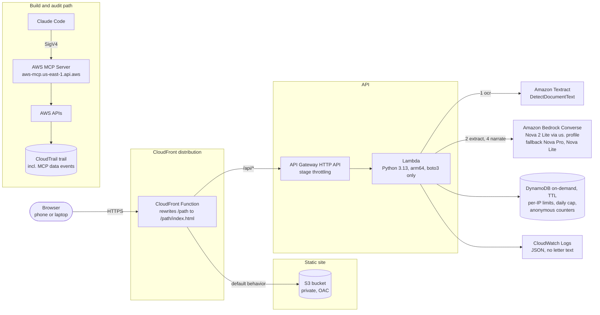

# Architecture

Plainly runs in one AWS account in us-east-1. Everything except the account-level CloudTrail trail is defined in a single plain CloudFormation template, `infra/template.yaml`. The agent's own IAM policy and the permissions boundary for roles it creates are in `infra/agent-iam-policy.json` and `infra/plainly-boundary-policy.json`.

Values in `{{...}}` are filled in after deploy.

## Diagram



The `/api/*` path goes through the same CloudFront distribution as the site, so the browser only ever talks to one origin.

## ASCII fallback

```
                          +---------------------------------------------+
Browser ---- HTTPS -----> | CloudFront (one URL)                        |
                          |   CloudFront Function: /x -> /x/index.html  |
                          +-------------+-------------------+-----------+
                                        | default           | /api/*
                                        v                   v
                          +-------------------+   +-----------------------------+
                          | S3 bucket         |   | API Gateway HTTP API        |
                          | private, OAC      |   | stage throttling            |
                          | pre-rendered HTML |   +--------------+--------------+
                          | + sample results  |                  |
                          +-------------------+                  v
                                                  +-----------------------------+
                                                  | Lambda (Python 3.13, arm64) |
                                                  |  POST /api/check            |
                                                  |   1 ocr      -> Textract    |
                                                  |   2 extract  -> Bedrock     |
                                                  |   3 verify   (pure Python)  |
                                                  |  POST /api/explain          |
                                                  |   4 narrate  -> Bedrock     |
                                                  +---+--------------+----------+
                                                      |              |
                                                      v              v
                                           +----------------+  +-------------------+
                                           | DynamoDB (TTL) |  | CloudWatch Logs   |
                                           | rate limits,   |  | JSON, ids and     |
                                           | daily cap,     |  | timings only,     |
                                           | counters       |  | no letter text    |
                                           +----------------+  +-------------------+

Build path:  Claude Code --SigV4--> AWS MCP Server --> AWS APIs --> CloudTrail trail
```

## What happens when you check a letter

1. The browser shrinks the photo to a JPEG of at most 1.5 MB (2000 px on the long edge). A PDF is rendered in the browser with pdf.js, and up to three pages are stacked into one JPEG. Pasted text skips this step.
2. `POST /api/check` runs three steps in one Lambda call.
   - ocr: Textract `DetectDocumentText` reads the image. Regular expressions pull phones, URLs and email addresses from that text. The model never supplies them.
   - extract: Bedrock Converse with a forced tool call, `record_letter`. The model returns the claimed sender, agency, dates, deadlines, payment requests, threats and similar items, each with the exact quote it came from.
   - verify: plain Python. Each model quote is checked against the Textract text. The rules in `backend/verifier.py` run, sender contacts are matched against `backend/registry.json` (domains first, then phones), relative deadlines are computed from the letter date, and the verdict is scored. Every step appends an entry to `trace[]`.
3. The browser shows the verdict, the quoted flags and the trace, then calls `POST /api/explain`.
4. `POST /api/explain` asks Bedrock for a plain explanation in the chosen language, next steps, jargon, questions to ask and, when the verdict is not "Likely scam", a reply draft. Dates come from the verified check result. The model is not allowed to compute them.
5. The browser builds the `.ics` calendar file itself.

The check and the explanation are separate requests because API Gateway HTTP APIs stop waiting after 30 seconds. Each request has its own budget: `/api/check` aims for 25 seconds, the extract call has a 14-second read timeout with at most one retry, and model fallbacks are skipped once the Lambda has less than 8 seconds left.

## Services and why each one is here

| Service | Role | Why this one |
|---|---|---|
| Amazon CloudFront | One public HTTPS URL for the site and the API | A stable AWS URL, and the bucket can stay private |
| CloudFront Function | Rewrites `/how-it-works` to `/how-it-works/index.html` | An S3 REST origin behind OAC does not resolve directory paths. A blanket 403-to-index rule would also hide real API errors. |
| Amazon S3 with Origin Access Control | Static, pre-rendered HTML, sample results, video | The landing page and the sample results can be read without JavaScript, by people and by crawlers |
| Amazon API Gateway HTTP API | `/api/*` routes | Built-in throttling. A Lambda Function URL behind OAC would need every POST to carry an `x-amz-content-sha256` header. |
| AWS Lambda (Python 3.13, arm64) | Handler, pipeline, verifier | No third-party dependencies: boto3 only, so the zip is small and there is nothing to patch |
| Amazon Textract | Independent OCR | A second reader, so a model quote can be checked against text the model did not write |
| Amazon Bedrock (Nova 2 Lite) | Extraction with quotes, then plain-language narration | Accepts images and supports tool calling. Cheap per call. |
| Amazon DynamoDB (on-demand, TTL) | Per-IP rate limit, global daily cap, anonymous counters | Pay per request, and TTL cleans up rate-limit rows automatically. No letter content is written. |
| Amazon CloudWatch | Structured logs without letter text (14-day retention), an ops dashboard, and four alarms: Lambda errors, Lambda p95 duration over 20 s, API 5xx responses and Bedrock throttles | Operations without storing personal data |
| Amazon SNS | Sends alarm and budget notifications to email | The alarms need somewhere to go |
| AWS CloudTrail (account level) | Audit trail, including AWS MCP Server data events | Shows which calls the coding agent made through MCP |
| AWS Budgets | Monthly cost budget, $10 by default | An alert only. It does not stop spend, which is why the daily cap exists. |

## Guardrails

- Nothing about a letter is stored. The letter text lives in the Lambda's memory for one request and is returned to the browser. Logs hold request ids, verdicts, rule ids, timings and token counts.
- The per-IP limit is 20 checks an hour. The IP comes from the `CloudFront-Viewer-Address` header, which the client cannot set, falling back to the API Gateway source IP.
- A global cap of 400 checks a day, counted in DynamoDB. Past either limit the API returns 429 or 503 and the page offers the pre-computed sample letters instead.
- The server rejects image payloads over 2.2 MB of base64.
- The Lambda role can write its own log group, read and write its own DynamoDB table, call Textract `DetectDocumentText`, and invoke Nova models through the `us.` inference profile and the foundation models in us-east-1, us-east-2 and us-west-2. It can carry the `plainly-boundary` permissions boundary.
- API Gateway stage throttling is 5 requests a second with a burst of 10. The Lambda has 1024 MB and a 29-second timeout.
- Instructions hidden in a letter and aimed at AI tools count as a strong scam signal. Their text is never shown anywhere; the flag says only that such an instruction was found.

## Model access details

- Nova 2 Lite has no in-Region endpoint in us-east-1. Calls use the US geo inference profile `us.amazon.nova-2-lite-v1:0`, which routes to us-east-1, us-east-2 and us-west-2. The IAM policy has to allow the inference profile and the foundation model in all three Regions. ([model card](https://docs.aws.amazon.com/bedrock/latest/userguide/model-card-amazon-nova-2-lite.html))
- The model card lists client-side tool calling as supported and structured outputs as not supported, so extraction uses a forced tool call. If `toolChoice: {"tool": ...}` is rejected, the code retries with `{"any": {}}`, and parses JSON from text as a last resort.
- Fallback chain: `us.amazon.nova-2-lite-v1:0`, then `us.amazon.nova-pro-v1:0`, then `us.amazon.nova-lite-v1:0`.

## Cost per letter

| Item | Figure |
|---|---|
| Measured Bedrock tokens per check + explain | {{TOKENS_PER_LETTER}} (from the Converse `usage` fields) |
| Measured cost per letter, all services | {{COST_PER_LETTER}} |
| Textract `DetectDocumentText` | $0.0015 per page, first million pages ([AWS pricing page example, US West (Oregon)](https://aws.amazon.com/textract/pricing/)) |
| Lambda, API Gateway, DynamoDB, CloudFront, S3 | Within free tier or pennies at hackathon traffic {{CONFIRM after a week of billing data}} |

## Deploy

`scripts/deploy.sh` packages the Lambda zip, runs `aws cloudformation package` and `aws cloudformation deploy`, syncs `dist/` to the bucket and invalidates CloudFront. It runs in Git Bash on Windows. A deploy from the agent's shell is a CLI call, and CloudTrail records it that way; calls the agent makes through the AWS MCP Server appear with `eventSource` `aws-mcp.amazonaws.com`. {{CONFIRM: which production changes, if any, went through MCP change sets}}
